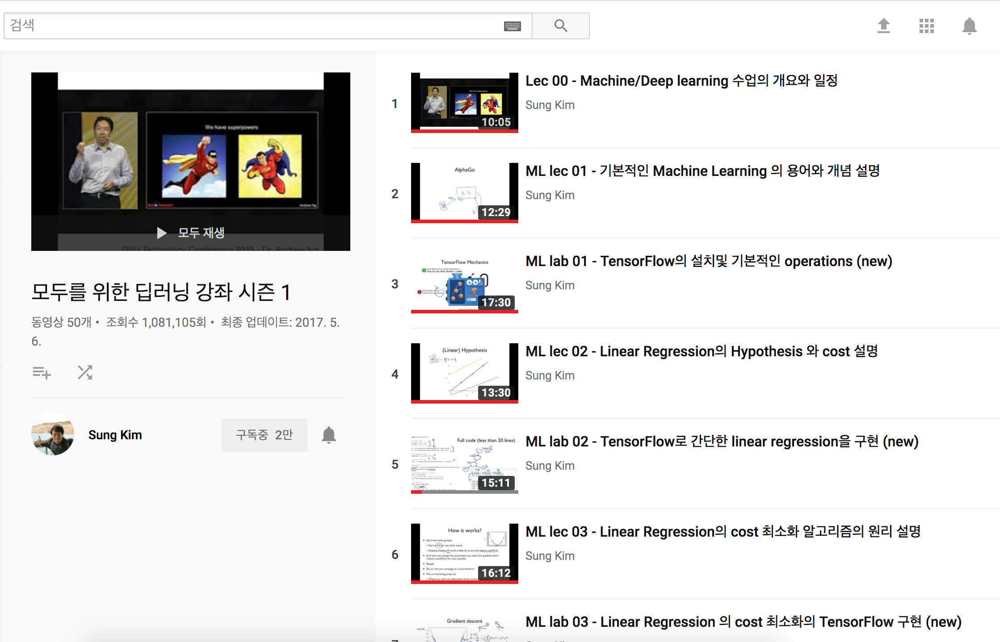

2018.03.04 - 초고작성 
2019.12.25 - Git 블로그 옮김  

**사랑하면 알게 되고 알면 보이나니 그때 보이는 것은 전과 같지 않으리라.**
ㅡ 나의 문화유산답사기 서문

 
이제 3년차 엔지니어가 되었다
예전 spring 관련 conference 3년차 개발자의 발표에선 무언가 기술에 대한 자부심같은게 느껴졌었다
나도 나만의 무기를 가져야겠다고 마음먹은건 그 때쯤 이었던 것 같다

비전공자 출신의 내가 어떻게 머신러닝에 관심을 가지게되었는지

무엇보다 프로그래밍, AI에 관심을 갖기시작한 학생, 직장인들에게 어느부분부터 시작하면 좋을지 

조금이나마 도움이 되었으면 하는 마음에

계속 공부를 해야하는 나의 입장에서도 도움이 될것이라^^;

이제까지 공부해왔던 과정을 글로 정리해서 남기고자 한다

  

2017년 4월. 한창 코세라 강의들에 관심을 가지고 스칼라며 몇몇 강의들을 살펴보다가

머신러닝에 대해 알게되었다

머신러닝에 대한 관심은 자연스럽게 처음시작할만한 참고자료를 찾기 시작했고

모두를 위한 딥러닝 강좌를 알게되었다
 

## [모두를 위한 머신러닝/딥러닝 강의](http://hunkim.github.io/ml/) 

홍콩과기대 김성훈 교수님의 친절한 설명으로 머신러닝의 바다로 나아간다

참고로 [김성훈 교수님의 이력](http://m.mt.co.kr/renew/view.html?no=2013052615345024115&googleamp)을 알게되면서 더 관심을 가지고 따르게(?) 되었다

lec과 lab으로 나뉘어 이론에 대한 설명을 듣고 그 내용이 어떻게 소스로 적용이 되었는지 알수있다

TensorFlow 설치부터 시작해서 Linear Regression, Linear/Softmax Classification, Regression, 딥러닝의 기본개념,

CNN. RNN 까지 거의 모든 내용을 다루지만 그 깊이가 얕지않다

처음 시작하는 입문자들에게는 한국어로 된 아주 좋은 강의자료이다

교수님도 다른 여러자료들을 참고하여 만드신 강의라

공부할 거리들을 많이 알려주셔서 더 좋았다

해당 강의를 제공하는 [김성훈 교수님의 Youtube 재생목록](https://www.youtube.com/user/hunkims/playlists) 에는 

모두를 위한 RL강좌, PyTorchZeroToAll(in English), PR12 딥러닝 논문읽기 모임 등 

다양한 공부거리가 있다
  

## [TensorFlow KR](https://www.facebook.com/groups/TensorFlowKR/)
 
모두를 위한 머신러닝/딥러닝 강의 를 듣게 되면 자연스럽게 알게되는 커뮤니티 
많은 사람들이 계속해서 관심있는 주제에 대해 글과 자료를 공유해서 꾸준히 읽어보는것만으로도 도움 
[김성훈 교수님이 네이버 선행AI연구팀 CLAIR 에 합류한다는 기사](http://m.zdnet.co.kr/news_view.asp?article_id=20170907095125#imadnews)를 접하고 교수님을 꼭 만나보고 싶다는
생각이 들었다 그래서 아마 이때부터 자료들과 책들을 좀 더 깊이있게 찾아보기 시작한것같다
  
## [밑바닥부터 시작하는 딥러닝](http://www.hanbit.co.kr/store/books/look.php?p_code=B8475831198)

혼자서 공부를 하기에 좋은 책 검색을 하다가 여러 책들중 고르고 골라 

서점에 직접가서 읽을만한 책을 찾은 결과다

딥러닝으로 이미지를 인식하는데 필요한 기술을 배운다

퍼셉트론, 신경망, 신경망학습, 오차역전파법, CNN, 딥러닝 까지 

아래의 책소개처럼 라이브러리나 프레임워크를 사용하지않는데 이는 핵심개념을 이해하는데

더 도움이 된다고 생각한다

***직접 구현하고 움직여보며 익히는 가장 쉬운 딥러닝 입문서\*** 

 *이 책은 라이브러리나 프레임워크에 의존하지 않고, 딥러닝의 핵심을 ‘밑바닥부터’ 직접 만들어보며 즐겁게 배울 수 있는 본격 딥러닝 입문서입니다. 술술 읽힐 만큼 쉽게 설명하였고, 역전파처럼 어려운 내용은 ‘계산 그래프’ 기법으로 시각적으로 풀이했습니다. 무엇보다 작동하는 코드가 있어 직접 돌려보고 요리조리 수정해보면 어려운 이론도 명확하게 이해할 수 있습니다. 딥러닝에 새롭게 입문하려는 분과 기초를 다시금 정리하고 싶은 현업 연구자와 개발자에게 최고의 책이 될 것입니다.*

딥러닝 책과 함께 출퇴근 시간 시간나는대로 참고할만한 블로그, 사이트들도 찾기시작했다
  
## [라온피플 머신러닝 아카데미](http://blog.naver.com/PostList.nhn?blogId=laonple)

블로그에는 주제별로 자세히 나누어 찬찬히 설명을 해준다

이런블로그를 운영하고 꾸준히 사람들에게 공유하려고 한다는데

라온피플 이라는 회사에 입사할수 있다면 괜찮겠다는 생각까지 했었다

강소기업이라고 생각하며 시간이 될때마다 읽어보려 노력중이다

 
## [다크 프로그래머](http://darkpgmr.tistory.com/)

영상처리, 프로그래밍에 대해 다소 난이도 있는 주제들에 대해 자료를 정리해두었다

단순히 지식을 아는것이 아니라 그것의 원리를 알고 이야기를 한다는데서 내공을 느낄수있었다

기계학습, 수학이야기 그 외 다른 카테고리들도 참고할만하다
   

머신러닝에 대한 호기심에서 시작했던 공부가

시간이 갈수록 학문에 대한 갈증과 더 많은 호기심을 자극하기 시작했다

김성훈 교수님이 계신 CLAIR 팀에 합류하고 싶어서 준비했던 것들은

그동안 내가 보내왔던 시간들을 정리해볼수 있는 계기가 되었고

대학생때 수강했던 금융공학 수업 교수님, SCSA 부장님, 함께 근무했던 차장님께

지원동기를 말씀드리고 추천서를 받는 과정은 다른 사람들에게서 신뢰를 받는다는 기분이 들어서

나에게는 아주 큰 의미가 있었다

 영문 이력서 작성, 팀에 합류해서 같이 구현해보고 싶은 주제설명,

논문을 소스코드로 직접구현하는 과정은

많은시간이 소요되었고 결과적으로는 합류하지 못했지만

적지않은 소득이 있었다

이론적으로 지식만 아는것과 직접 소스코드로 구현해보는건  하늘과 땅의 차이다

기본적인 학습이 완료되었다고 생각한다면

아래의 논문들을 찾아서 읽고 소스로 구현해보는것을 추천한다

논문을 읽기 시작하면서 선형대수를 포함한 수학/통계적 지식, 영어공부의 필요성을 느꼈고

이것들을 어떻게 보완 준비해나가는지는 다음글에서 소개하겠다

  
읽어볼만한 논문들

- StarGAN (Using TF or something. non PyTorch: https://arxiv.org/abs/1711.09020 )
- Seq-to-Seq translation (https://arxiv.org/abs/1409.0473 )
- VQ-VAE (http://papers.nips.cc/paper/7210-neural-discrete-representation-learning )
- CapsuleNet (https://arxiv.org/abs/1710.09829 )
- Deep Speaker (https://arxiv.org/abs/1705.02304 )
- Show, attend, and tell (https://arxiv.org/abs/1502.03044 )
- SqeezeNet (https://arxiv.org/abs/1602.07360 )
- Recurrent Highway Network (https://arxiv.org/abs/1607.03474 )
- Tacotron2 - excluding WaveNet-vocoder (https://arxiv.org/abs/1712.05884 )
- Generative Adversarial Imitation Learning (https://arxiv.org/abs/1606.03476 )
- DARLA (https://arxiv.org/abs/1707.0847)

  

[나의 머신러닝 답사기2](https://parksunwoo.github.io/ml_voyage2/)

 

