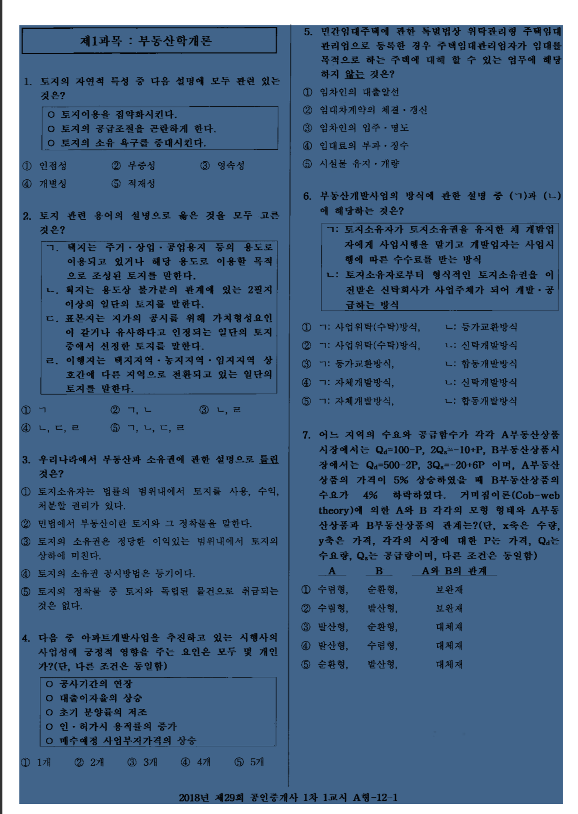
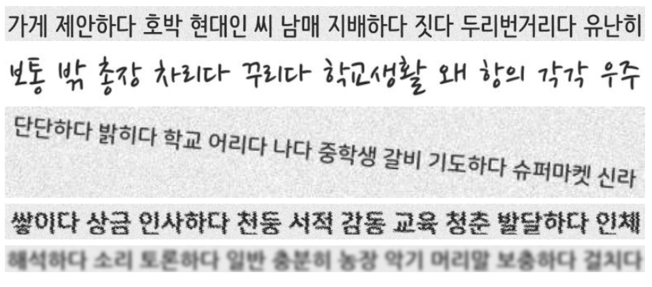

올해 4월부터 10월까지 6개월동안 개인프로젝트를 진행했고 그 과정에서 주제선정부터 논문작성까지 배우고 익힌것들을 정리해보려 한다

### **프로젝트의 시작**

처음 개인프로젝트의 주제로 정했던 건 딥러닝을 활용한 시험 문제 예측 서비스 구현이었다. 미래문 이라는 일본 최초 AI를 활용한 자격시험 문제 예측 서비스 관련 기사를 읽고 미래문의 기록을 깨보자는 생각에서 출발했었다.

[인공지능에 의한 국가시험문제 출제 예측 '미래문'의 개요](https://lh6.googleusercontent.com/f_BRvMYBp6OMP3V7JvCzKUakMqQb5nNxcWaiyEquXQSbvJWqkl8MroUJCjUFgBr_tG8_NgFZnqR4aCPQnc-4GD2-5TDB-Xfc0dQCvQaCgjWLCqTncBLhWM5M34ySJ8XJPRfGHiHN)

과거 기출문제 그리고 문제집, 위키백과 데이터를 이용해서 128개 정도의 카테고리로 분류를 하고 RNN을 사용해서 올해 출제될 문제의 카테고리를 추출하는 방식이었다. 5월 한달동안은 데이터 수집 및 분석을 하기로 마음먹고 공인중개사, 공무원시험, 국가자격시험 데이터를 모으기 시작했다.

우선은 주요타겟이 될 시험을 선정해야했고 나름의 선정기준을 정해야했다

- 가장 중요한 기출문제 데이터를 쉽게 구할수 있고 시험횟수가 최소 10회 이상
- 시험응시 인원이 많아서 예측결과가 실제로 도움이 될수있게
- 계속 시험이 유지되어야 (사법시험...)

선정기준을 고려했을 때 공인중개사 시험이 2018년까지 29회차이었고 기출문제도 2005년 이후(15회 분량)는 박문각 사이트에서 쉽게 구할수있었다. 연1회 시험이나 1,2차 5개과목 * 과목당 40문항으로 계산했을 때 5지선택형이라 어림만으로 3000문항 정도가 되었다. EBS 온라인 모의고사 데이터도 4년 * 7회 * 200문항 으로 5600 문항 이었다. 여기까지 모든게 순조로웠다.

하지만 발목을 잡는 문제가 생겼는게 데이터 전처리 관련 부분이었다. 기출문제와 EBS 모의고사는 모두 pdf 파일 형식이나 모의고사 데이터는 글자인식이 가능한 타입이고, 기출문제는 단순 이미지 파일이라 데이터로 변환하기 위해선 수작업을 하거나 OCR 프로그램을 돌려야 했다

###### [How to extract text from a PDF file?](https://stackoverflow.com/questions/34837707/how-to-extract-text-from-a-pdf-file)

많은 사람들이 해결방법을 찾고있는 문제이고 문자인식 성능이 그리 좋지않으나 한글은 더욱 좋지않다...

[최강 자격증 기출문제 전자문제집 CBT](https://www.comcbt.com/)
검색을 통해 기출문제를 따로 모아두는 사이트를 발견했으나 여기에선 기출문제 복원이라는 (이미지 파일을 수작업으로 한글문서화) 작업을 진행하고 있었다.

OCR 이게 주제가 될 수 있을까?
이미지로 되어있는 기출문제를 문자데이터로 변환가능한지?

이 때부터 OCR 관련 블로그와 서비스, 기술논문들을 찾아보기 시작했다.

[아날로그 기상 데이터를 OCR로 디지털화할 수 있을까?](https://brunch.co.kr/@kakao-it/319)
[카카오 OCR 시스템 구성과 모델](https://brunch.co.kr/@kakao-it/318)
[텐서플로로 OCR 개발해보기: 문제점과 문제점과 문제점](https://brunch.co.kr/@kakao-it/304)
[딥러닝과 OpenCV를 활용해 사진 속 글자 검출하기](https://d2.naver.com/helloworld/8344782)

##### [Scene-Text-Understanding](https://github.com/tangzhenyu/Scene-Text-Understanding)

##### [online OCR](https://www.onlineocr.net/)

##### 기업에서도 풀고싶어하는 문제이고 영문에 비해 한글의 경우 이렇다할 서비스가 제공되지도 않고 있어 충분히 진행해볼만한 프로젝트라는 생각이 들었다.

### 한글 데이터셋 준비

기존 한글 OCR 데이터가 있는지 있다면 사용할 수 있는 수준인지 확인이 필요했다. [ICDAR 2019 Task 1: Multi-script text detection](https://rrc.cvc.uab.es/?ch=15) 에 한국어 이미지 데이터가 있었으나 1000개 정도이고 짧은 단어로 구성되어 있었다.
[KAIST Scene Text Database](http://www.iapr-tc11.org/mediawiki/index.php/KAIST_Scene_Text_Database) 는 카이스트에서 제공하는 이미지 데이터셋으로 디지털카메라 또는 휴대폰으로 촬영한 간판, 책표지, 기타 이미지였다. 생성된 일자가 2011년이고 진행하려는 한글문서 이미지와는 조금 차이가 있어서 활용하기에힘들었다. 한글 데이터셋을 어떻게 구할지, 구하지 못하면 포기해야하나 하는 생각이 들었다. 궁하면 통한다고 깃허브에서 OCR 프로그램 트레이닝을 위한 [TextRecognitionDataGenerator](https://github.com/Belval/TextRecognitionDataGenerator) 소스를 발견했다. 라틴어계열만 제공되었는데 다행인건 폰트와 사전데이터만 있으면 한글 이미지 데이터도 생성할 수 있었다. 폰트는 네이버 [나눔글꼴](https://hangeul.naver.com/2017/nanum)과 [폰트코리아](http://www.font.co.kr/yoonfont/free/main.asp) 에서 모은 99종의 폰트데이터와 국립국어원에서 한국어 학습용 어휘목록 데이터를 구해 사용했다. (5965개 단어) 

 한글 문장 데이터를 생성해야 해서 한글 입숨이나 반크이야기, 한국소설에서 문장을 가져올까 하다가 어휘목록의 단어들을 10개씩 랜덤으로 뽑으면 문장의 길이와 일치하는 문장이 생성될것이라 생각해 그대로 진행했다. 생성되는 문장타입은 지정한 방식에 따라 기본, 기울기, 왜곡, 흐리게 처리, 배경이미지 포함으로 있었다. 문서이미지에 많이 분포할 것을 보이는 기본과 기울기 타입은 각 9000 개씩, 나머지 타입은 각 3000 개씩 생성해서 27,000 개의 한글문장 이미지 데이터셋을 확보했다. 

각 이미지 데이터의 예시는 해당 [URL](https://github.com/parksunwoo/ocr_kor#generate-train-validation-data) 에서 확인가능하다. 참고했던 TextRecognitionDataGenerator 에서도 손글씨체 타입이 있었고 프로젝트를 진행하는 중에도 네이버 클로바에서 [나눔손글씨 글꼴](https://clova.ai/handwriting) 을 제공해서 추가로 연구를 진행한다면 손글씨 폰트를 포함해서 다양한 데이터셋을 확보해보고 싶다.
