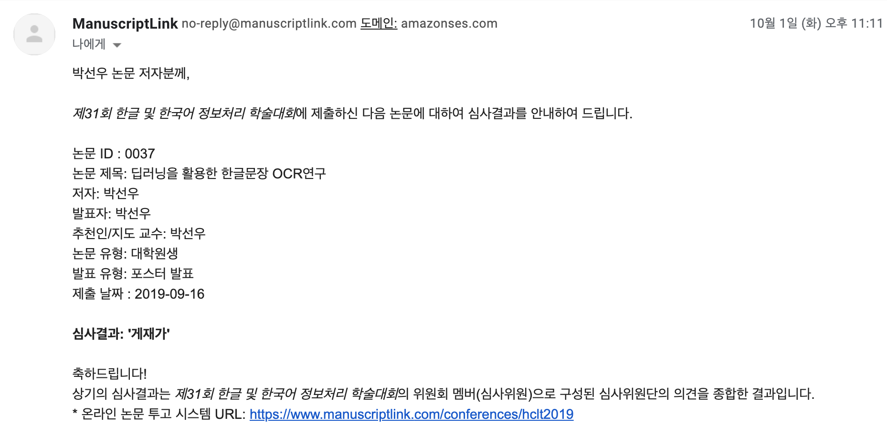
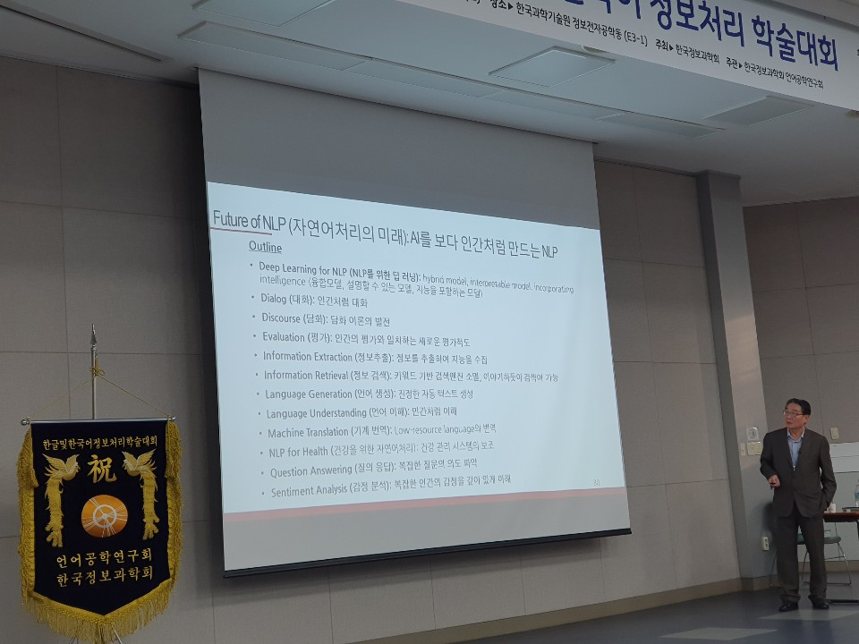

### OCR 개요

OCR 모델은 크게 문자탐지와 문자인식으로 구성되고 이 둘을 따로 구분하지 않고 end to end 방식으로 연결해서 진행하는 방식이 있다. 
문자탐지, Text Detection은 아래 논문을 참고했다

[TextBoxes: A Fast Text Detector with a Single Deep Neural Network](https://arxiv.org/abs/1611.06779) 
[PixelLink: Detecting Scene Text via Instance Segmentation](https://arxiv.org/abs/1801.01315) 
[FOTS: Fast Oriented Text Spotting with a Unified Network](https://arxiv.org/abs/1801.01671) 
[Character Region Awareness for Text Detection](https://arxiv.org/abs/1904.01941) 

기존 문자탐지 모델은 (이미지 속 글자에 적합한 후보를 생성하고 필터링하고 그룹화하는) 우리가 처음 생각하기 쉬운 방식대로 진행하다보니 시간이 많이 소요되고 여러 단계로 나뉘어져 있어 튜닝이 어려웠다. 실시간으로 진행하는건 기대하기도 어려웠다. 하지만 물체감지에서 성능향상을 보인 SSD 아이디어를 가져와 TextBoxes를 사용해서 성능과 정확도 향상을 가져왔다. 그리고 TextBoxes에서 발견된 문제점을 해결하기 위해 의미분할을 사용한 PixelLink가, 문자탐지와 문자인식을 연결해 인식률을 높이기 위한 방법으로 FOTS가 제안되었다. 

위 논문들을 읽고 일부논문은 요약정리를 시도했다. 그리고 깃허브에서 해당코드를 찾아서 수행해보기 시작했는데 스타를 다수 받은 깃의 경우에도 실제로 수행해보면 문제가 좀 많았다. loss 가 nan 으로 출력되기도 하고. 여러 모델 코드들을 수행하면서 훈련했던 모델이 날라가기도 하고 linux 명령어에 익숙치 않아 찾아보면서 하는데 시간이 많이 소요되었다. 

문자인식, Text Recognition은 아래 논문을 참고했다.

[An End-to-End Trainable Neural Network for Image-based Sequence Recognition and Its Application to Scene Text Recognition](https://arxiv.org/abs/1507.05717) 
[Gated Recurrent Convolution Neural Network for OCR](https://papers.nips.cc/paper/6637-gated-recurrent-convolution-neural-network-for-ocr.pdf) 
[Focusing Attention: Towards Accurate Text Recognition in Natural Images](Focusing Attention: Towards Accurate Text Recognition in Natural Images) 
[MORAN: A Multi-Object Rectified Attention Network for Scene Text Recognition](https://arxiv.org/pdf/1901.03003.pdf) 
[Text recognition (optical character recognition) with deep learning methods](https://github.com/clovaai/deep-text-recognition-benchmark) 

문자인식은 앞서 문자탐지에서 넘어온 입력값에서 정확한 문자를 분별해내는 과정이다. 단일모델만으로는 한계가 있어서 CNN과 RNN을 합친 CRNN과 Gate + RNN + CNN 의 GRCNN이 제안되었다. Gate는 CNN과 RNN의 정보를 균형있게 제어하는 역할을 수행한다. 또한 어텐션 드리프트 문제를 해결하기 위해 어텐션 네트워크와 포커싱 네트워크를 합친 FAN(Focusing Attention Network)도 제안되었다.

그리고 이러한 문자탐지와 문자인식을 별개로 구분하지 않고 연결되는 하나의 모델로 구현한 것이 Aster, TextSpotter 이다

[ASTER: Attentional Scene Text Recognizer with Flexible Rectification](https://ieeexplore.ieee.org/abstract/document/8395027/) 
[An end-to-end TextSpotter with Explicit Alignment and Attention](https://arxiv.org/abs/1803.03474) 
[An Overview of the Tesseract OCR Engine](https://static.googleusercontent.com/media/research.google.com/ko//pubs/archive/33418.pdf) 

한글 OCR에 대한 딥러닝 연구가 이전에도 진행되었으나 단일모델을 사용하고 글자단위의 이미지로 진행되어 한계점을 지니고 있었다. 기존 문자탐지와 문자인식 모델들에 앞에서 생성한 한글문장 데이터를 사용해서 성능을 확인해본결과 문자탐지는 잘 수행되었고 문자인식 부분에서 개선할 부분이 있다고 판단하였다. 

### 모델구조와 실험결과

문자탐지와 문자인식으로만 구분되던 것을 좀 더 세분화해서 변환, 특성추출, 시퀀스, 예측 4개모듈로 구분하였다.(모델구성은 아래 네이버 clova 팀의 논문을 참고) 변환 모듈은 TPS(Thin Plate Spline) 사용여부에 따라, 특성추출 모듈은 VGGNet, RCNN, ResNet 으로, 시퀀스 모듈은 BiLSTM 사용여부에 따라, 예측 모듈은 CTC(Connectionist Temporal Classification) 과 어텐션 으로 구성되었다. 따라서 4개 모듈조합은 전체 경우의 수가 2 x 3 x 3 x 2 = 24가지가 나와 한글 문장에 적합한 모듈조합을 찾고자 모든 조합에 대한 실험을 진행했다. [실험기록](https://github.com/parksunwoo/ocr_kor/issues) 

24개의 모델을 하이퍼파라미터를 튜닝해가면서 가장 높은 정확도의 모델을 찾는 작업은 생각이상으로 많은 시간이 소요되었다. 한개 모델을 수행하는데 batch_size 192에 num_iter 를 300,000 회 기준이다보니 2-3일정도 시간이 걸렸다. Pytorch에서 Multi-GPU로 학습하는 게 실험시간을 줄이는데 무엇보다 중요하다고 생각했고 당근마켓 블로그의 [PyTorch Multi-GPU 제대로 학습하기]([https://medium.com/daangn/pytorch-multi-gpu-%ED%95%99%EC%8A%B5-%EC%A0%9C%EB%8C%80%EB%A1%9C-%ED%95%98%EA%B8%B0-27270617936b](https://medium.com/daangn/pytorch-multi-gpu-학습-제대로-하기-27270617936b)) 포스트를 참고했다. 결론적으로는 상황에 따라 다소 차이가 있긴하지만 Nvidia Apex를 사용하면 multi gpu를 활용할 수 있다는 내용이었다.

네이버 clova 팀의 [What Is Wrong With Scene Text Recognition Model Comparisons? Dataset and Model Analysis](https://github.com/clovaai/deep-text-recognition-benchmark) 논문에서 최고 정확도의 모델조합은 TPS-ResNet-BiLSTM-Attn (영문 단어기준 84%) 이었으나 한글문장 데이터로 실험한 결과 TPS-VGG-BiLSTM-Attn 으로 88.24% 의 정확도가 나왔다.

### 향후 연구과제 그리고 느낀점

높은 정확도가 나왔지만 실시간 서비스에 활용되기에는 정확도와 시간을 더 줄여야할 것으로 보인다. 모델부분에서는 최신 언어모델을 활용해 모델조합을 더 늘려야 하고 데이터 부분에서는 얼마전 공개된 네이버의 손글씨체 폰트를 활용해서 더 다양한 한글문장 이미지 데이터셋을 확보할 수 있을 것으로 보인다. 실험이 어느정도 진행된다면 본래 진행하려던 한글문서로 범위를 확장해서 진행해보고 싶다.

이미지화 되어있는 기출문제를 디지털 문서로 변환하는데서 출발했지만 해당 문제는 실제로 기업 비즈니스에서도 현재 중요한 문제로 이야기되고 있다고 한다. -[AMA with 우정훈 (KPMG NY Data Scientist)](https://www.youtube.com/watch?v=h1Szcj0_kYU&list=PLIXnubKzTJX6-lOj5BkbrUy3GEqnqSz2W)  계약서를 비롯한 기업의 여러문서들이 인쇄물로 보관되어있는 게 많고 이를 디지털화 하는 작업이 선행되어야 데이터분석 및 ML/DL 이 가능해진다. OCR 기술은 중요한 기술이었던 것이다.

논문을 학회에 제출해보면서 몇가지 알게된 것들이 있다. 학회는 우선 포스터발표와 세션발표가 있고, 세션발표는 2-30분정도 시간을 갖고 강의실에서 발표할 기회가 주어진다. 그리고 포스터발표는 자신의 연구내용을 A1 사이즈 전지에 정리해 넓은 공간에서 관심있는 사람들에게 설명할 수 있는 1-2시간 정도의 발표시간을 갖는다.  
 
조금은 충격적이었던 것은 학회논문을 개인이 혼자서 발표하는 케이스는 나말고는 없었다. 보통은 기업의 연구팀에서 오던지 아니면 팀원들과 함께 논문을 작성해서 제출하는 것이 보통이었다. 이럴 수 밖에 없는게 논문을 작성하는 건 시간투자가 많은 일이라 정확한 이해관계가 없이 단순 호기심으로만 진행하기에는 다소 무리가 있어 보였다. 그리고 딥러닝 관련 논문들은 논문내용을 잘 정리해서 작성하는 것과 진행하려는 실험을 코드를 작성해서 시간안에 원하는 결과를 가져오는 것이 구분되어있다. 따라서 팀원들끼리 각자의 역할을 정해서 분업화 하지 않으면 안된다는 생각이 들었다. 

학회에 논문을 투고하면, 투고하는 논문양식에는 저자에 관한 정보없이 오로지 논문의 내용만 담긴다, 얼마간의 심사기간을 거쳐 (나의 경우 2주일) 심사위원의 심사점수 및 심사평과 함께 게재여부가 회신된다.  

심사결과 : "게재가"  메일을 확인했을 때가 올해 가장  행복한 괴로운 순간이었다.   

심사위원의 심사평에는 보완해야할 부분에 대한 내용도 기재가 된다. 

위원회 멤버 #1
실험과 관련된 분석이 더 추가되었으면 좋을 것 같습니다.

위원회 멤버 #2
기존의 OCR모델과 비교하여 제안방법의 차이를 보다 분명히 언급하면 좋을 것 같습니다.

최종본 (Camera-ready Paper)를 작성하기까지는 이틀정도의 시간이 주어졌는데 부족한 부분을 보완하기 위해 거의 잠을 못잤다. 그래도 학회에 가볼수있다는 사실이 설레게 해서 학회발표일이 많이 기다려졌다. 대전 카이스트에서 열린 학회는 한글과 자연어처리에 관심많은 사람들이 발표하고 질문하는 장이었다. 다음에 기회가 된다면 더 견고한 논문을 작성해서  우수논문으로 채택되보고 싶다는 생각을 해본다. 

마지막으로 임해창 교수님의 강연에서 인상깊었던 내용을 적으며 긴글을 마치고자 한다. 
과거의 연구들은 과거에 머물러있는게 아니라 현재 그리고 미래의 연구를 이해하고 발전시키는데 밑거름이 될것입니다.  

[딥러닝을 활용한 한글문서 OCR 연구: https://github.com/parksunwoo/ocr_kor](https://github.com/parksunwoo/ocr_kor)  

