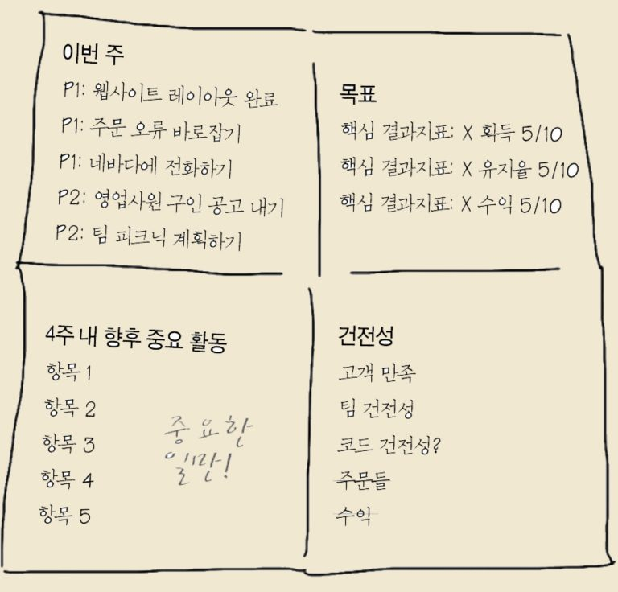

우리의 시간은 한정되어있다. 시간을 쏟아부어서라도 이루고 싶은 목표를 설정하고 그 목표를 달성하기 위한 눈에보이는 확실한 계획(3개정도)을 세우는걸 말한다.  
계획을 세우는 것만큼 지속적으로 계획달성을 위한 자신감 체크가 필요하다. 매주 마지막에 그 주의 성과를 알리고 서로 격려하는게 목표달성을 위해 무엇보다 중요하다

아래 내용은 [OKR(한국경제신문)](http://www.yes24.com/Product/Goods/67014359) 책 주요 내용을 정리

우리는 중요하고 긴급한 일에 시간을 써야 하며, 그런 일을 해야 한다. 또한 중요하지만 긴급하지 않은 일에도 시간을 써야 한다. 중요하지 않지만 긴급한 일에는 시간을 쓰지 말아야 한다.

*목표*들은 수월한 것과 어려운 것으로 나뉘는게 아니다 그것들은 모두 도전적이고 어려운 목표들이어야 한다 5/10은 달성할 확률이 50대 50이라는 뜻이고 자신감이 내려갔다면 그 이유를 찾아 상황을 파악해야한다

*건전성 지표*는 원대한 목표를 실행하는 동안 지켜야 하는 것들
새 고객을 찾느라 경솔하게 현재 있는 고객들을 잊어서는 안되겠죠 → 고객만족 적음
매주 논의할 것들 두세가지만 정하고 OKR과 건전성 지표를 똑같이 만드는건 맞지 않다

*이번주*에 당신이 해야 할 중요한 일 3-5가지를 적어요. 
이건 누가 제일 바쁘게 일하는지를 보여주는 대결이 아니에요. 당신이 하는 모든 일을 목록에 올리는 게 아니라, 반드시 실행해야 하는 일들만 적는 거에요. 핵심은 중요한 일들을 잊지 않는 거에요.

*4주내 주요활동*
전 그걸 "알림"이라고 불러요 다음 달에 일어날 거라고 예상되는 중요한 일들 목록이죠. 이렇게 미리 알리면 다른 팀 사람들이 뭔가 지원 요청을 받을 때 무방비 상태로 있다가 당황하지 않죠
 
**우리가 목표를 달성하지 못하는이유**

1. 목표들의 우선순위를 정하지 않았다
2. 철저하고 집요하게 소통하지 않았다
3. 일을 완수하기 위한 계획이 없다
4. 중요한 것을 위해 시간을 할애하지 않았다
5. 재도전하지 않고 포기한다
 
**OKR의 기본원칙**

질적이고 영감을 주는 목표
시간 제한이 있는 목표
각 팀이 독립적으로 행동할 수 있는 목표
좋은 목표들의 예시

- 사우스베이의 기업 대상 커피 시장을 장악하자
- 훌륭한 최소기능제품을 출시하자
- 팰로앨토의 쿠폰 사용 습관을 바꾸자
- 다음 분기를 끝장낼 거래를 체결하자

**핵심 결과지표의 조건**

내 생각에 그 지점은 50대 50인 곳. 만일 마음 속 깊은 곳에서 '이것들을 달성하려면 진짜 젖 먹던 힘까지 끌어와야겠네' 라는 생각과 함께 조금 재미있는 기분이 든다면 핵심 결과지표를 제대로 세운 것

**금요일, 축하하고 공유하라**

목표를 높게 세우면 당연히 실패도 많이 할 수 밖에 없다. 목표를 높게 세우는 것은 좋지만 자신이 얼마나 많이 발전했는지 알지 못한 채 목표를 이루지 못했다는 사실만 생각한다면 몹시 절망적인 기분이 든다. 그 때문에 금요일 자축 시간이 굉장히 중요하다 무엇이든 보여줄 수 있는 것을 시연하고 외에도 모든 팀이 뭔가를 공유해야 한다
이렇게 하면 몇 가지 좋은 점이 있다
첫째 직원들은 자신이 매우 특별하고 성공적인 팀의 일부라고 느끼기 시작
둘째 각 팀들은 뭔가 공유할 만한 업적을 이루고 싶어서 점점 목표를 달성하려고 노력
마지막 회사는 각 팀이 어떤 일을 하고 있는지 알 수 있고 모두가 하루 종일 무엇을 하는지를 이해하기 시작

**OKR을 이용하는 간단한 팁**

- 당신의 회사에 다양한 사업 분야가 있지 않은 이상, 회사의 OKR은 단 하나만 세워라. 집중이 제일 중요하다
- OKR이 당신이 하는 일의 전부는 아니다. 그것은 당신이 '반드시' 해야 하는 한 가지 일이다.
- 월요일 OKR 점검은 대화 시간이다. 자신감 변화와 건전성 지표, 우선순위를 반드시 논의
- OKR을 여기저기에서 눈에 띄도록 만들어라 구글은 내부 전산망에 OKR이 있다
- 금요일 자축 행사는 월요일부터 시작된 엄숙한 분위기를 풀어주는 해독제 긍정적이고 즐겁게하라