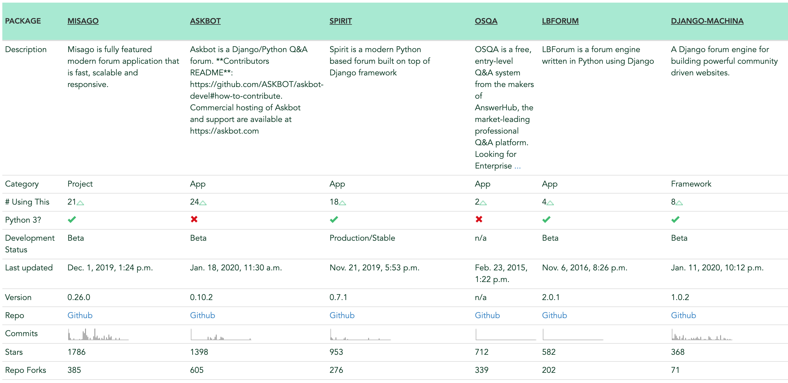

> There’s no such thing as a free lunch
>
> 공짜 점심이라는 것은 없다

스타트업에 와서 피부로 체감한 것은 제한된 자원으로 운영된다는 것이다. 부족한 인력이지만 정해진 기간안에 프로젝트를 더 완성도 있게 만들어야 한다. 맨땅부터 개발하기에는 시간이 많이 소요되고 오픈소스를 잘 활용하는 것이 중요하다. 요즘 추세가 오픈소스를 많이 사용하기도 하고. 그렇다면 오픈소스를 그냥 가져다가 프로젝트에 사용하면 될까? 본인이 만드는 서비스가 상업용인지, 오픈소스 라이센스를 꼼꼼히 확인해봐야 한다. 오픈소스의 라이센스별로 허용하는 범위가 조금씩 달라 공개정도가 가장 높은 AGPL의 경우, AGPL를 포함해서 만든 프로젝트 소스를 전부 공개해야한다! 

오픈소스 관련해서 찾았던 내용들을 중요부분 위주로 정리해보려 한다.

## FOSS(Free and Open-Source Software)

여기서는 Free 는 공짜가 아닌 자유를 의미. 어떤 제품을 개발하는 과정에 필요한 소스코드나 설계도를 누구나 접근해서 열람할 수 있도록 공개하는 것. 소프트웨어 말고도 개발 과정이나 설계도가 공개되는 경우 하드웨어에도 오픈 소스 모델이 적용 할 수 있으며, 글꼴과 같은 데이터에도 오픈 소스 개발 모델이 적용되는 경우가 있다. 
 단순히 소스를 공개만 하는 것이 아니라, 이를 2차 창작하는 것을 허용하기도 하고, 나아가 조건 없이 상업적 용도로까지 사용할 수 있게 하는 경우가 있다.

개발자의 경우 소스가 공개되어 있다면 본인이 직접 소프트웨어의 문제를 수정하거나 개선할 수 있게 된다. 오픈 소스 소프트웨어는 코드가 공개되어 있기 때문에 회사의 사정에 따라 개발이 중지되더라도 다른 개발자/개발사에서 이를 이어받아서 개선해 나가면서 개발하는 것이 된다. 그래서 개발자와 사용자가 일치하는 개발 툴 및 시스템, 네트워크 분야에는 웬만한 상용 소프트웨어와 비교되지 않을 정도로 고품질의 오픈 소스 소프트웨어가 넘쳐난다. 서버 운영 체제에서 리눅스가 그 대표적.

## 오픈 소스 소프트웨어 라이선스

오픈소스는 독점적인 권리가 없을 뿐이지, 저작권은 존재한다. 강제성이 가장 강한것이 GPL인데, GPL은 오픈 소스인 만큼 소스코드를 자유롭게 수정배포할 수 있는 권리를 보장하지만, 재귀적 전염성 조항이라는 특이적인 성질이 부여된다. GPL 소스로부터 파생된 프로그램도 소스가 공개되어야 하고, 파생된 프로그램 또한 강제로 GPL 라이선스로 배포되어야 한다.

GPL 라이선스를 약간 완화시킨 것이 LGPL 라이선스이고, 소스 재공개를 아예 하지 않아도 되거나 라이선스의 전염성 조항이 없는 MIT/Apache 라이선스 등도 있다. 통계자료를 보면 최근(2017년 기준) 에는 GPL을 기피하고 MIT 허가서를 사용하는 빈도가 급증하였다. 

BSD 라이선스처럼 GPL 같은 재귀적 전염성 조항이 없는 오픈 소스 라이선스들도 존재한다. 

## 주요 라이선스

#### GNU 일반 공중 사용 허가서 (GPL)

자유소프트웨어재단에서 만든 라이선스로 가장 강력한 제약 조건을 포함하고 있는 카피레프트 조항. GPL 프로그램은 어떤 목적으로, 어떤 형태로든 사용할 수 있지만 사용하거나 변경된 프로그램을 배포하는 경우 무조건 동일한 라이선스 즉 GPL로 공개해야 한다. 

#### GNU Affero GPL (AGPL)

수정한 소스코드를 서버에서만 사용하는 개발자가 그 프로그램을 배포하지 않을 경우 사용자는 소스코드를 가질 수가 없는 문제를 해결하기 위해 마련됐다. 서버에서 프로그램을 실행해 다른 사용자들과 통신하면, 실행되고 있는 프로그램의 소스코드를 사용자들이 다운로드할 수 있게 해야한다는 조항을 담고있다. 웹서비스 포함!

#### GNU Lesser GPL (LGPL)

GPL은 사용하기만 하더라도 해당 소스코드를 GPL로 공개해야 하는 부담감 때문에 상용 소프트웨어로 쓰기 부담스럽다는 단점. 자유 소프트웨어 제품이 더 많이 쓰이고 표준이 되도록 유도하기 위해 단순한 라이브러리. 모듈 링크를 허용한 라이선스이다. 
수정한 소스코드 LGPL로 공개 (static linking 으로 사용하면 전체 코드 공개)

#### MIT 허가서

MIT라이선스는 미국 매사추세츠공과대학교 (MIT) 에서 해당 대학 SW 공학도들을 돕기 위해 개발한 라이선스이다. 라이선스와 저작권 관련 명시만 지켜주면 되는 서비스로, 가장 느슨한 조건을 가진 라이선스 중 하나이기 때문에 인기가 많다.

#### 아파치 라이선스

아파치소프트웨어재단이 자체적으로 만든 라이선스다. 소스코드 공개 의무 같은 의무사항은 없지만, 아파치 라이선스 소스코드를 수정해 배포하는 경우 아파치 라이선스 버전 2.0을 꼭 포함시켜야 하며 아파치재단에서 만든 소프트웨어임을 밝혀야 한다. 
BSD 의무사항 + 특허권(GPL2.0 으로 배포되는 코드와는 결합 불가능)

#### BSD 라이선스

버클리의 캘리포니아대학에서 배포하는 공개 SW 라이선스다. BSD 자체가 공공기관에서 만들어낸 것이므로 공공의 몫으로 돌려주자는 의미가 강해, 라이선스 자체에는 아무런 제한 없이 누구나 자신의 용도로 사용할 수 있다. 라이선스 및 저작권 표시 조건 외엔 제약이 없는, 굉장히 자유로운 라이선스. 소스코드를 공개하지 않아도 되는 대표적.

#### 크리에이티브 커먼즈 라이선스

자유로운 이용을 장려함과 동시에 저작권자의 권리를 보호. 컴퓨터 프로그램을 제외한 모든 저작물에 사용할 수 있다. 자유이용을 위한 최소한의 요건으로 많은 사람들이 원하는 것을 조사하여 그 중 대표적인 4가지 이용허락조건을 뽑아낸 다음 이를 조합해서 6가지 유형의 라이선스를 만들었다.

**이용허락조건**

- Attribution (저작자 표시) : 저작자의 이름, 출처 등 저작자를 반드시 표시 해야 한다는, 라이선스에 반드시 포함되는 필수조항
- Noncommercial (비영리) : 저작물을 영리 목적으로 이용할 수 없습니다. 영리목적의 이용을 위해서는 별도의 계약이 필요하다는 의미
- No Derivative Works (변경금지) : 저작물을 변경하거나 저작물을 이용한 2차적 저작물 제작을 금지한다는 의미
- Share Alike (동일조건변경허락) : 2차적 저작물 제작을 허용하되, 2차적 저작물에 원 저작물과 동일한 라이선스를 적용해야 한다는 의미

#### 오픈소스 소프트웨어의 배포의 개념

소스코드 및 / 또는 바이너리 (실행) 코드의 카피를 다른 사람에게 제공하는 행위 (이동매체를 이용한 전달 포함)

#### 다중 라이선스?

하나의 코드를 2가지 혹은 그 이상의 라이선스로 배포하는 형태
저작권자가 선택 사항으로 독자적인 유료 보증 설정

#### GPL2.0 + Apache 2.0 = 배포 불가능

프로젝트에 GPL2.0 과 Apache2.0 오픈소스를 같이 사용했다면 배포할 수 없음
Apache2.0의 특허 보복 조항을 GPL2.0 에서는 보장하지 않아 라이선스 충돌(양립 불가)

## 라이선스는 오픈소스를 선택할때 고려해야할 중요한 요소

예를 들어 Django로 개발한다고 하고 django packages Forum 카테고리를 살펴보면 다음과 같은 Package들을 볼 수 있다. 가장 많은 스타수를 자랑하는 [MISAGO](https://djangopackages.org/packages/p/misago/) 프로젝트는 라이센스가 GPLv2라 새롭게 만들 프로젝트 역시 동일한 GPLv2 라이센스 이어야한다. 개인적으로 사용하기에는 부담이 없을 수 있으나 소스 비공개를 원한다면 사용이 힘들다. [Askbot](https://djangopackages.org/packages/p/askbot/)  스타수는 MISAGO 에 비해 적지만 사용되는 곳이나  포크 수에서는 앞선다. 라이센스는 GPLv3 이다.

GPL v3에서 가장 큰 변화는 특허에 있다. 기존의 버전2 GPL은 특허권과 양립 불가한 라이선스이다. 특허권자와 저작권자가 동일한 경우 특허권과 관련된 로열티를 포기한다는 조건에서만 해당 프로그램의 GPL 배포를 허용. 특허권자가 저작권자와 다를 경우는 특허 소유자가 로열티를 받지 않는 조건으로만 GPL 배포가 가능하다.

[Spirit](https://djangopackages.org/packages/p/spirit/) 은 앞의 프로젝트들에 비해 숫자들은 조금 약하지만 MIT 라이센스라 상업적 용도로 사용한다고해도 좀 더 자유롭게 사용할 수 있다. 

프로젝트의 UI 라던지 여러가지 특징들이 물론 더 중요하겠지만 사용하는 목적에 따라서 라이센스는 중요한 고려요소가 될 수 있다.

## 참고

[https://namu.wiki/w/오픈 소스](https://namu.wiki/w/%EC%98%A4%ED%94%88%20%EC%86%8C%EC%8A%A4) 
[creative commons korea](http://cckorea.org/xe/?mid=ccl) 
[GPL·AGPL·MPL…한눈에 보는 오픈소스SW 라이선스](http://www.bloter.net/archives/209318) 
[오픈소스를 사용하고, 준비하는 개발자를 위한 가이드](https://www.slideshare.net/ifkakao/ss-113145564) 

