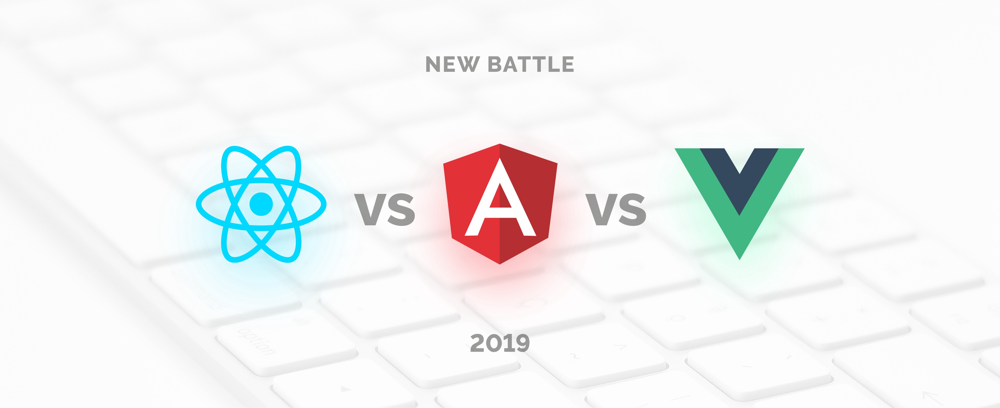

> The most personal is the most creative
>
> 가장 개인적인 것이 가장 창의적인 것이다

새로 옮긴 회사에서 진행하는 프로젝트는 내가 꼭 진행해보고 싶은 프로젝트였다. 그래서 입사전부터 몇번 시간을 내서 회사를 찾았고 프로젝트의 내용과 진행되는 사항들에 대해 팔로우 업을 하려고 했다. 정식 입사후, 한달동안에는 몇가지 주요기능들을 어떻게 구현할지 그리고 아키텍쳐를 설계하는 일을 했다. 시스템 아키텍처는 다음블로그에서 상세히 이야기하기로 하고 소프트웨어 아키텍쳐를 설계하는 일을 이번 블로그에서 이야기해보려 한다. 소프트웨어 아키텍쳐를 설계하는 일의 핵심은 어떤 언어를 사용할지를 정하는 일이라고 보아도 무방하다.

전에 있던 회사를 비롯한 대기업들은 보통 Java 로 개발을 많이 한다.
우선 자바라는 언어를 사용하는 숙련된 개발자들이 많고 아무래도 긴 시간동안 검증 되고 쌓여온 라이브러리를 통한 신뢰성을 간과하기 힘들다.

그렇다면 늘 사용하던 자바를 고수할 것인가?  기존에 사용해봤다는 이유가 선택의 이유가 될 수 없을 것 같았다. 개발자는 언어라는 도구에 제한되지 않을수 있어야 한다고 생각한다. 
Python에도 웹을 개발할때 사용하는 Django 가 있었다.  스타트업의  서버 프로그래밍 언어 리스트로 주로 이야기되는 것은 Node.js , Ruby on Rails, python의 Django 정도였다. 그동안 업무외적으로 학습을 하면서 파이썬의 단순함과 직관적인 부분이 마음에 들었기 때문에 고민끝에 Django 를 선택하게되었다.

rails는 최고의 생산성을 낼 수 있다는  뚜렷한 장점을 지니고 있고  진입장벽은 높지 않지만,  높은 수준에 도달하기까지는  학습 분량이 적지 않고  아직도 성능 이슈가 있었다. Node.js 는 single page application 이나 채팅에서 강점을 보이나 그 외에는 django 나 rails 보다 이렇다할 장점이 없다.

django 는 다른 후보들에 비해 단점이 적고 짧은 시간에 학습할 수 있다는게 강점이었다. 다만 시간이 지날수록 python에 대한 높은 이해도가 필요하고 한글 문서가 풍부한편은 아니었다. Django 관련 양질의 한글자료들은 아직도 많이 부족한 실정이다.  Django는 coursera, Udemy 그리고, 대표적인 성공사례로는 instagram을 꼽을 수 있다. 필자가 생각하기에 django의 강점은 어드민 기능을 따로 구현하지 않아도 처음 프로젝트를 생성하면 바로 구현되어 있다는 것이다. 이 부분이 가능해지면 초기에 웹사이트의 컨텐츠들을 쉽게 채울수있고 구현된 사이트를 빠르게 체크하고 다시 점진적으로 개발할 수 있다. 괜히 django 의 슬로건이  the web framework for perfectionist  with deadlines 가 아니다.

이하는 여러가지 정보들을 종합해서 선택한 기술스택들이다.

*데이터베이스* 
MySQL
쿼리튜닝만으로도 어느정도 부하는 견딜수 있기에 NoSQL보다는 RDBMS 선택. MySQL은 널리쓰이기도 하고 레퍼런스가 많음

*서버배치* 
OS
리눅스/ 우분투, 제일 관리하기 편한 배포판.

*웹서버 및 AP서버* 
Nginx, 이전에는 Apache, Jetty를 주로사용했으나 Nginx를 찾아서 비교해보니 모든 IO들을 전부 Event Listener로 미루기 때문에 메모리적인 측면에서 시스템 리소스를 적게 처리한다는 장점. 높은 성능

*CDN* 
Amazon CloudFront, 사내에서 사용중인 건 akamai이나 사용자 수로는 비교가 힘들고, 속도와 AWS서비스와의 호환성 그리고 Global 장점 고려. 높은 성능

*메시지 큐* 
Celery, 비동기 처리작업. 파이썬, django 호환.

*호스팅* 
AWS, 비용문제가 있긴한데 초기에는 AWS를 사용하다가 국내 호스팅업체로 옮기는 것도 하나의 방법

*서버 configuration & 자동화* 
Fabric은 가장 간단하고 쉽다

*CI tool* 
Jenkins, 사용하고있는 툴이기도 하고 무료, 레퍼런스 및 사용자가 많음

*서버운영* 
모니터링
New Relic, 쉽다

Failover
데이터베이스 주기적백업. 백업주기는 초기에 하루 한번으로 하다가 트랜잭션 늘어남에 따라 점차 늘려서 1시간에 1번까지로 늘려나감. 단순백업보다 더 나은 방법은 데이터베이스 redo log를 통해서 특정시점 재현, MySQL경우 Point-in-Time Recovery Using the Binary Log 제공

*로그분석* 
Google Analytics, 무료, 쉬운셋업, 시각화.

*프론트엔드* 
마지막으로 이야기 하고싶은게 프론트엔드 단인데 프론트 엔드부분은 만들려고 하는 웹사이트의 성격이 중요한 것 같고(정적인 사이트인지, 이벤트처리 를 포함하는 동적인 사이트인지) 프론트엔드 개발자가 선호하는 언어를 최대한 반영해서 React를 선택했다. 후보군으로는
React 와  Vue 를 고민했는데, 2가지 기술이 특성이 같으면서도 좀 다르다. 

vue의 장점은 
template 과 render function 을 모두 사용할수 있는 옵션, 
간편한 syntax 와 프로젝트 생성, 
빠른 렌더링과 더 작은 용량 정도를 꼽을 수 있다 

React의 장점은 
큰 규모에서 더 빛을 발하고 테스트가 수월하다
web 과 native 앱 개발에 모두 사용가능
더 큰 개발자 생태계에서 오는 많은 레퍼런스와 도구들

추가로 stackshare (https://stackshare.io/ ) 에서는 회사들이 사용하는 기술스택들을 비교해서 볼수있고 현재 어떤 기술스택이 인기가 있는지도 볼 수 있다. 기술스택을 선택함에 있어서 참고를 받을 수 있을 듯하다.

기술스택을 선택하는 일은 추후에 바꾸는 일이 발생하더라도 초기 개발의 방향을 정하는 일이라 여러가지 부분에서의 고려가 필요했다. 이런 기술스택을 자신만의 이유를 가지고 선정하는 것도 훌륭한 개발자의 몫이리라.

## 참고
[스타트업을 위한 기술스택](http://www.codeok.net/%EC%8A%A4%ED%83%80%ED%8A%B8%EC%97%85%EC%9D%84%20%EC%9C%84%ED%95%9C%20%EA%B8%B0%EC%88%A0%20%EC%8A%A4%ED%83%9D) 
[React인가? Vue인가?](https://joshua1988.github.io/web_dev/vue-or-react/) 

