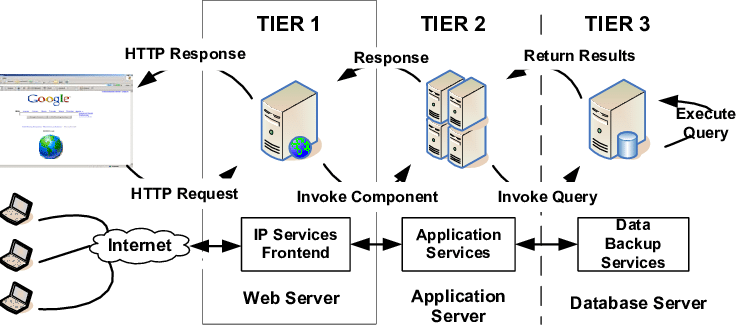
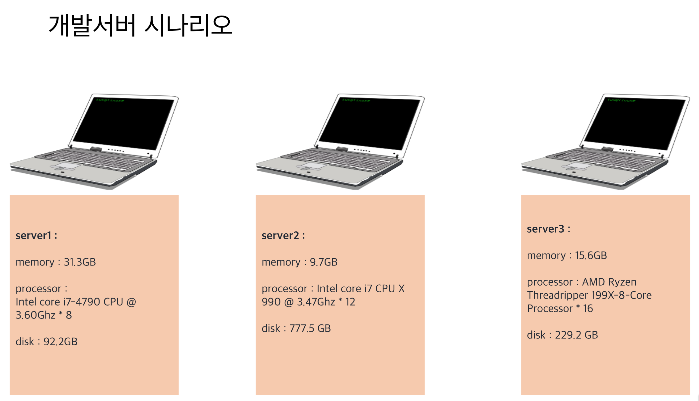
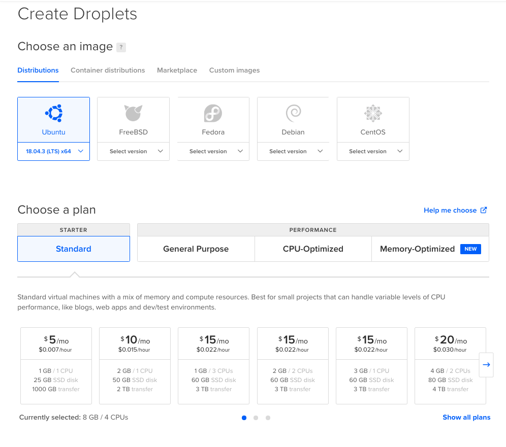
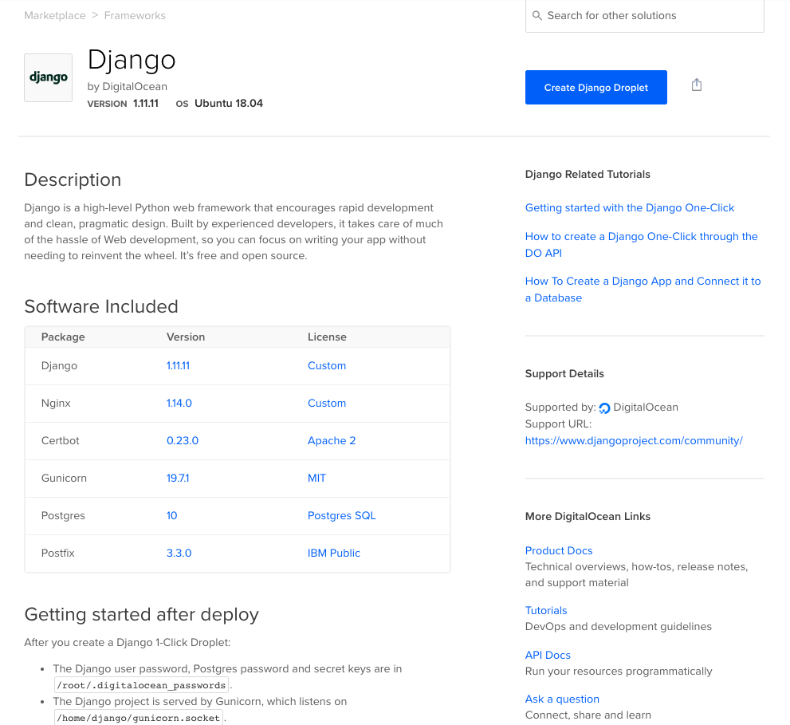

> If I only had an hour to chop down a tree, I would spend the first 45 minutes sharpening my axe.
>
> 나무 베는데 한 시간이 주어진다면, 도끼를 가는데 45분을 쓰겠다.

시스템 아키텍쳐 구성은 마지막까지도 결정하기가 어려웠던 소프트웨어 스택에 비해 정하기가 수월했다. 골라야하는 선택지가 상대적으로 적어서 부담이 덜 되었다. 3계층형 시스템 구성과 웹 데이터 흐름이 어떻게 되는지를 먼저 살펴보고 3계층형 시스템의 주요구성인 WEB / WAS / DB 서버의 특징을 살려 개발환경을 구성하는 시나리오를 적어봤다. 그리고 클라우드 환경에서 시스템환경을 어떻게 구성하는지 가이드가 될 사이트도 간단히 소개한다.

## 3계층형 시스템의 구성

3계층형 시스템은 프레젠테이션 계층, 애플리케이션 계층 그리고 데이터 계층의 3층 구조로 분할돼 있어서 3계층형이라고 부른다. 예를 들어, 인터넷 검색 시스템에서는 사용자가 웹 브라우저에 입력하는 화면은 프레젠테이션 계층의 웹 서버에 먼저 전달된다. 웹 서버는 그 요청을 뒤에 있는 애플리케이션 계층의 애플리케이션 서버(AP 서버)에 전달한다. AP서버는 검색 키워드를 바탕으로 무엇을 검색해야 할지 판단해서 뒤에 있는 데이터 계층의 데이터베이스 (DB서버에) 데이터를 요청한다. 
 클라이언트 - 서버형에 비해 특정 서버에 부하가 집중되는 문제가 해결된다는 것이 장점이다.   이 아키텍쳐에서는 모든 처리가 AP 서버나 DB서버를 이용하지 않아도된다. 이미지 파일만 읽으면 되는 경우라면 웹 서버만으로도 처리를 완료해서 결과를 반환할 수 있으므로 다른 서버에 부하를 주지 않는다.

프로세스는 전용 메모리 공간을 이용해 동작해서 개별 처리 독립성이 높지만, 생성 시 CPU 부하가 높다.
반면 스레드는 다른 스레드와 메모리 공간을 공유하고 있어 의도하지 않는 데이터 읽기/쓰기가 발생할수 있으나 생성시 부하가 낮다  

||
|:--:|
| *출처: https://www.researchgate.net/figure/A-Typical-3-Tier-Server-Architecture-Tier-1-Web-Server-Tier-2-Application-Server-Tier_fig1_221147997* |
  
**웹 데이터 흐름의 본질은 '요청 기반으로 어떠한 처리를 하고 필요에 따라 해당 요청을 삼자에게 할당하는 것'이라고 정의할 수 있다.**

1. 클라이언트 PC부터 웹 서버까지 
   1.1 웹 브라우저가 요청을 발행한다 
   1.2 이름 해석을 한다 
   1.3 웹 서버가 요청을 접수한다 
   1.4 웹 서버가 정적 콘텐츠인지 동적 콘텐츠 인지 판단한다 
   1.5~1.6 필요한 경로로 데이터에 액세스한다  
2. 웹 서버부터 AP 서버까지 
   2.1 웹 서버로부터 요청이 도착한다 
   2.2 스레드가 요청을 받으면 자신이 계산할 수 있는지, 아니면 DB 접속이 필요한지를 판단한다 
   2.3 DB 접속이 필요하면 연결 풀에 액세스한다 
   2.4~2.5 DB 서버에 요청을 던진다  
3. AP 서버로부터 DB 서버까지 
   3.1 AP서버로부터 요청이 도착한다 
   3.2 프로세스가 요청을 접수하고 캐시가 존재하는지 확인한다 
   3.3 캐시에 없으면 디스크에 액세스한다 
   3.4 디스크가 데이터를 반환한다 
   3.5 데이터를 캐시 형태로 저장한다 
   3.6 결과를 AP 서버에 반환한다  
4. AP 서버부터 웹 서버까지 
   4.1 DB 서버로부터 데이터가 도착한다 
   4.2 스레드가 데이터를 가지고 계산 등을 한 후에 파일 데이터를 생성한다 
   4.3 결과를 웹 서버로 반환한다  
5. 웹 서버부터 클라이언트 PC까지 
   5.1 AP 서버로부터 데이터가 도착한다 
   5.2 프로세스는 받은 데이터를 그대로 반환한다 
   5.3 결과가 웹 브라우저로 반환되고 화면에 표시된다 
  
## 개발서버 구성 시나리오

개발서버 구성에 앞서 서버를 구성하는 주요 요소에 대해 정리해보려 한다.

  - CPU: Central Processing Unit의 약자. 서버 중심에 위치해서 연산 처리. CPU는 명령을 받아서 연산을 실행하고 결과를 반환한다. 명령과 데이터는 기억장치나 입출력 장치를 통해 전달된다.  
  - 메모리: CPU 옆에 위치하며 CPU에 전달하는 내용이나 데이터를 저장하거나 처리 결과를 받음 
    메모리에 저장되는 정보는 영구성이 없다. 서버를 재시작하면 없어지는 정보임을 의미. 이런 결점에도 메모리를 사용하는 이유는 메모리 액세스가 매우 빠르게 이루어지기 때문이다. 그리고 데이터 저장 시에 물리적인 모터 등을 구동하는 것이 아니라 전기적인 처리만으로도 데이터를 저장.  
  - 하드디스크 드라이브 (HDD): 주로 장기 저장 목적의 데이터 저장 장소로 사용한다. 메모리는 전기가 흐르지 않으면 데이터가 사라지지만, 디스크는 전기가 없어도 데이터가 사라지지 않는다.  

아래 3개 서버사양으로 개발환경을 구성하려는 시나리오를 만들어봤다. server 1,2,3의 어떤 스펙을 주요하게 보고 지정할 것인가?  
||
|:--:|
| *당신은 개발서버를 어떻게 구성할 것인가?* |
 
우선 메모리가 가장 높은 서버는 31.3GB의 server1이고 CPU코어수가 가장 높은건 16개인 server3, disk 저장용량이 가장 높은건 777.5GB의 server2이다. 앞에서 정리한 내용에 따르면 CPU 코어수가 높은 server3을 WEB, WAS 서버로 메모리가 높은 server1을 DB서버로 하는게 적당해보인다.

## Digital Ocean
3계층형 시스템의 일부 또는 전부가 클라우드 서비스 제공자가 보유하고 있는 물리 서버에 동작하는 걸 클라우드형 아키텍쳐라 한다. 대부분의 가상화 기술에서는 서버가 가상적인 존재로 동작한다. 이 방식을 이용하면 물리서버를 구입하는 것에 비해 비용이 낮고 바로 사용할 수 있다는 장점이 있지만, 보안문제나 클라우드 서비스 제공자와의 네트워크 연장 문제등이 있을 수 있다. 
  [DigitalOcen](https://www.digitalocean.com/) 은 클라우드 호스팅 업체로 가성비가 뛰어나기로 유명하다. 현재기준 (2020년 2월) 60일 한정으로 100 달러 크레딧을 제공해서 개발용으로 테스트해보기에도 안성맞춤이다. 처음 시작하면 원하는 Droplets 을 생성할 수 있고 최소 5달러부터 시작해서 부담이없다. 사용해보면서 좋았던 점은 django 사이트를 만들겠다고 하면 web, was, db 서버포함해서 원클릭으로 구성을 바로 해볼 수 있다. 평소 구성해보고 싶었던 기술스택이나 솔루션을 바로 생성해보고 또 튜토리얼 문서가 잘 작성되어있어 서버환경을 구성할때에 좋은 참고자료가 된다.   

|  |
| :-----------------------------------------------: |
| *최소사양 5달러 스펙은 개발용으로 충분하다* |

|           |
| :------------------------------------------------: |
| *원클릭으로 당신만의 Django 사이트를 만들수있다* |
 
기승전 클라우드가 된 것 같지만 클라우드를 처음부터 이야기 하지 않은것은 시스템 아키텍쳐에 대한 고민을 해보기 위해서였다.
쉬운 방법으로 가게되면 얻게 되는 지식도 많지 않으리라.

## 참고

그림으로 공부하는 IT인프라 구조 chapter 1~3, 제이펍 
[아이패드로 코딩하기](https://boxnwhis.kr/2020/01/11/coding_with_ipad.html)  

